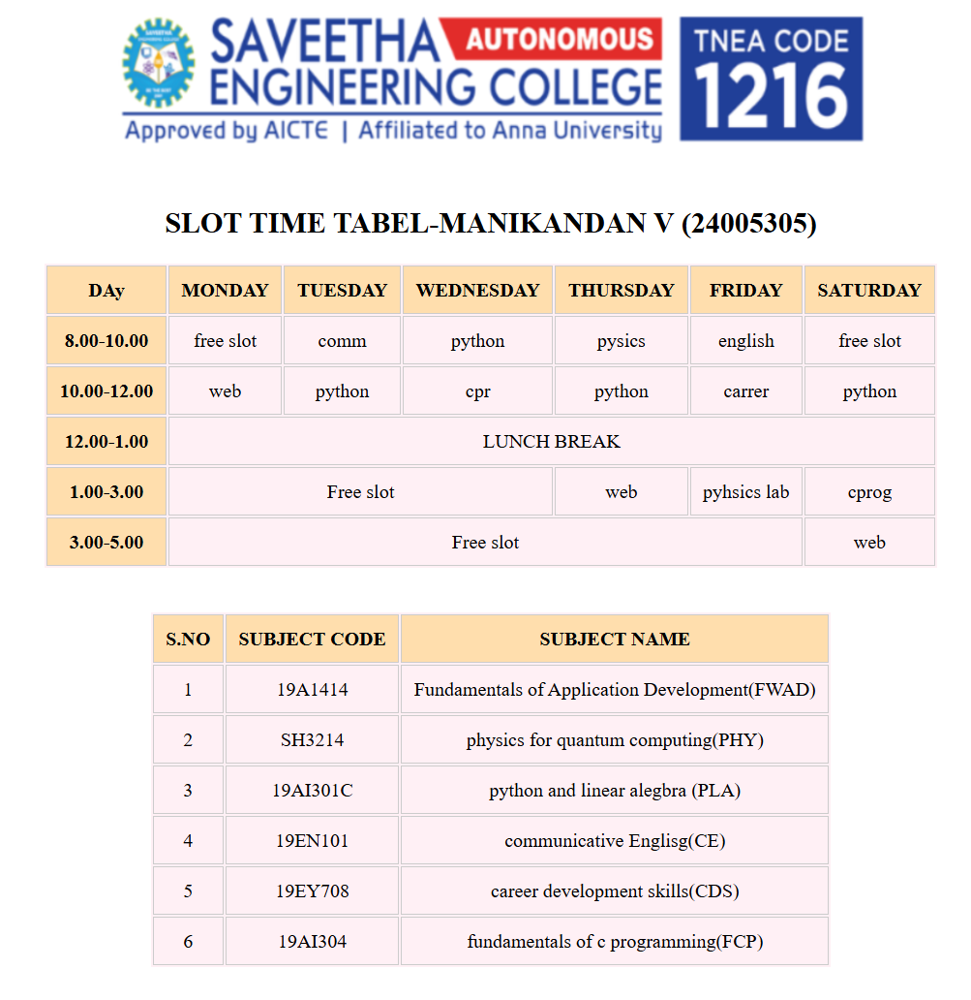

# Ex03 Time Table
# Date:
# AIM
To write a html webpage page to display your slot timetable.

# ALGORITHM
## STEP 1
Create a Django-admin Interface.

## STEP 2
Create a static folder and inert HTML code.

## STEP 3
Create a simple table using <table> tag in html.

## STEP 4
Add header row using `<th>` tag.

## STEP 5
Add your timetable using <td> tag.

## STEP 6
Execute the program using runserver command.

# PROGRAM
views.py
```
from django.shortcuts import render
def table(request):
    return render(request,'time.html')
```
settings.py
```

from pathlib import Path


BASE_DIR = Path(__file__).resolve().parent.parent

SECRET_KEY = 'django-insecure-&znesj#f-8tma0l8^q1hxkv!6#)13w%wssog+q4u(!s0sc--te'


DEBUG = True

ALLOWED_HOSTS = []


INSTALLED_APPS = [
    'django.contrib.admin',
    'django.contrib.auth',
    'django.contrib.contenttypes',
    'django.contrib.sessions',
    'django.contrib.messages',
    'django.contrib.staticfiles',
    'timetable',
]

MIDDLEWARE = [
    'django.middleware.security.SecurityMiddleware',
    'django.contrib.sessions.middleware.SessionMiddleware',
    'django.middleware.common.CommonMiddleware',
    'django.middleware.csrf.CsrfViewMiddleware',
    'django.contrib.auth.middleware.AuthenticationMiddleware',
    'django.contrib.messages.middleware.MessageMiddleware',
    'django.middleware.clickjacking.XFrameOptionsMiddleware',
]

ROOT_URLCONF = 'experi.urls'

TEMPLATES = [
    {
        'BACKEND': 'django.template.backends.django.DjangoTemplates',
        'DIRS': [],
        'APP_DIRS': True,
        'OPTIONS': {
            'context_processors': [
                'django.template.context_processors.debug',
                'django.template.context_processors.request',
                'django.contrib.auth.context_processors.auth',
                'django.contrib.messages.context_processors.messages',
            ],
        },
    },
]

WSGI_APPLICATION = 'experi.wsgi.application'


DATABASES = {
    'default': {
        'ENGINE': 'django.db.backends.sqlite3',
        'NAME': BASE_DIR / 'db.sqlite3',
    }
}


AUTH_PASSWORD_VALIDATORS = [
    {
        'NAME': 'django.contrib.auth.password_validation.UserAttributeSimilarityValidator',
    },
    {
        'NAME': 'django.contrib.auth.password_validation.MinimumLengthValidator',
    },
    {
        'NAME': 'django.contrib.auth.password_validation.CommonPasswordValidator',
    },
    {
        'NAME': 'django.contrib.auth.password_validation.NumericPasswordValidator',
    },
]


LANGUAGE_CODE = 'en-us'

TIME_ZONE = 'UTC'

USE_I18N = True

USE_TZ = True


STATIC_URL = 'static/'


DEFAULT_AUTO_FIELD = 'django.db.models.BigAutoField'

```
urls.py
```
from django.contrib import admin
from django.urls import path
from timetable import views

urlpatterns = [
   # path('admin/', admin.site.urls),
   path('timetable',views.table)
]

```
time.html
```
<!doctype html>
  <html>
    <head>
	   <title>table</title>
	   
	      <style>
		  
		    <style>
        table {
            width: 100%;
            border-collapse: collapse;
        }
        th, td {
            border: 1px solid #ccc;
            padding: 10px;
            text-align: center;
        }
        th {
            background-color:navajowhite;
        }
		td,table {
            background-color:lavenderblush;
        }
    </style>
</head>
<body>
      <center>
        

   
<h2>SLOT TIME TABEL-MANIKANDAN V (24005305)</h2>
<table>
    <thead>
        <tr>
            <th>DAy</th>
            <th>MONDAY</th>
            <th>TUESDAY</th>
            <th>WEDNESDAY</th>
			
            <th>THURSDAY</th>
            <th>FRIDAY</th>
			<th>SATURDAY</th>
			
        </tr>
    </thead>
    <tbody>
        <tr>
            <th>8.00-10.00</th>
            <td>free slot</td>
            <td>comm</td>
            <td>python</td>
            <td>pysics</td>
			<td>english</td>
			 <td>free slot</td>
          </tr>
        <tr>
            <th>10.00-12.00</th>
            <td>web</td>
            <td>python</td>
            <td>cpr</td>
			<td>python</td>
			<td>carrer</td>
			<td>python</td>
         </tr>
        <tr>
            <th>12.00-1.00</th>
			<td colspan="6">LUNCH BREAK</td>
         </tr>
       
        <tr>
             <th>1.00-3.00</th>
              <td colspan="3">Free slot</td>
			<td>web</td>
			<td>pyhsics lab</td>
			<td>cprog</td>
        </tr>
        <tr>
		  <th>3.00-5.00</th>
		  
			<td colspan="5">Free slot</td>
			<td>web</td>
        </tr>
		  
    </table>
        
    </tbody>
     <br><br>
    <table>
       <tr>
        <th>S.NO</th>
        <th>SUBJECT CODE</th>
        <th>SUBJECT NAME</th>
       </tr>
       <tr>
        <td>1</td>
        <td>19A1414</td>
        <td>Fundamentals of Application Development(FWAD)</td>
     </tr>
     <tr>
        <td>2</td>
        <td>SH3214</td>
        <td>physics for quantum computing(PHY)</td>
     </tr>
     <tr>
        <td>3</td>
        <td>19AI301C</td>
        <td>python and linear alegbra (PLA)</td>
     </tr>
     <tr>
        <td>4</td>
        <td>19EN101</td>
        <td>communicative Englisg(CE)</td>
     </tr>
     <tr>
        <td>5</td>
        <td>19EY708</td>
        <td>career development skills(CDS)</td>
     </tr>
     <tr>
        <td>6</td>
        <td>19AI304</td>
        <td>fundamentals of c programming(FCP)</td>
     </tr>


    </table>
</center>
</body>
</html>
     
```
# OUTPUT

# RESULT
The program for creating slot timetable using basic HTML tags is executed successfully.
